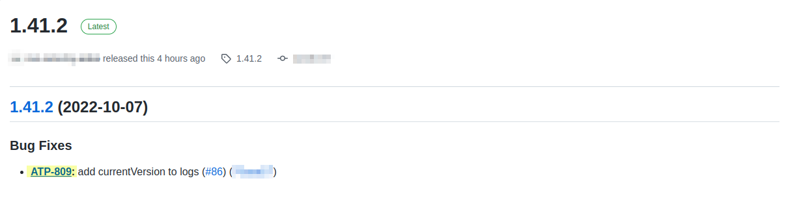

# semantic-release-jira-notes

[![ESM-only package][package]][package-url]
[![NPM version][npm]][npm-url]
[![Node version][node]][node-url]
[![Dependencies status][deps]][deps-url]
[![Install size][size]][size-url]

[package]: https://img.shields.io/badge/package-ESM--only-ffe536.svg
[package-url]: https://nodejs.org/api/esm.html

[npm]: https://img.shields.io/npm/v/semantic-release-jira-notes/latest.svg
[npm-url]: https://www.npmjs.com/package/semantic-release-jira-notes

[node]: https://img.shields.io/node/v/semantic-release-jira-notes/latest.svg
[node-url]: https://nodejs.org

[deps]: https://img.shields.io/librariesio/release/npm/semantic-release-jira-notes
[deps-url]: https://libraries.io/npm/semantic-release-jira-notes/tree

[size]: https://packagephobia.com/badge?p=semantic-release-jira-notes
[size-url]: https://packagephobia.com/result?p=semantic-release-jira-notes

[**semantic-release**](https://github.com/semantic-release/semantic-release) plugin to add links to
JIRA issues in the release notes.

For each JIRA issue detected in the release notes, it will add a link that brings directly to this issue on JIRA.


| Step               | Description                                          |
| ------------------ | ---------------------------------------------------- |
| `verifyConditions` | Validate the config options                          |
| `generateNotes`    | Generate the release notes with links to JIRA issues |


## Preview



## Usage

### Installation

```bash
# npm
npm install --save-dev semantic-release-jira-notes
# yarn
yarn add --dev semantic-release-jira-notes
# pnpm
pnpm add --save-dev semantic-release-jira-notes
```

### Inputs

| Name           | Required | Description                                                            |
| -------------- | :------: | ---------------------------------------------------------------------- |
| jiraHost       |    ✅     | Your JIRA host domain name                                             |
| ticketPrefixes |    ❌     | Ticket prefixes to match. If not provided, match all tickets prefixes. |

### Configuration

```json
{
  "plugins": [
    "@semantic-release/commit-analyzer",
    ["semantic-release-jira-notes", {
      "jiraHost": "iamludal.atlassian.net",
      "ticketPrefixes": ["ATP", "OMS"]
    }]
    "@semantic-release/git",
    "@semantic-release/github"
  ]
}
```

> **Note**: this plugin uses `@semantic-release/release-notes-generator` under the hood, so you don't need to use it anymore.

You can also use options defined by [@semantic-release/release-notes-generator](https://github.com/semantic-release/release-notes-generator#options).

```json
{
  "plugins": [
    "@semantic-release/commit-analyzer",
    ["semantic-release-jira-notes", {
      "jiraHost": "iamludal.atlassian.net",
      "preset": "conventionalcommits",
      "presetConfig": {
        "types": [
          { "type": "feat", "section": "Features" },
          { "type": "fix", "section": "Bug Fixes" },
          { "type": "build", "section": "Dependencies Updates", "hidden": false }
        ]
      }
    }]
    "@semantic-release/git",
    "@semantic-release/github"
  ]
}
```
